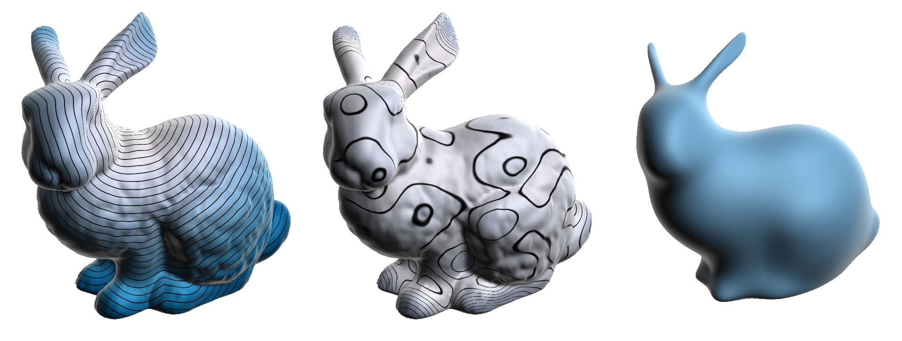

I’m a computer scientist with an MSc degree in computer science from Federal Fluminense University, Niteroi - Brazil. Prior, I have earned my BSc degree in computer science from the National University of Saint Augustine, Arequipa - Peru. My research interest is about geometry processing, shape analysis, computational geometry, machine learning, and computer vision. I also have an interest in algorithms, data structures, graphs, and parallel programming. I like to solve competitive programming problems within my free time.

Recent Works
======

## gproshan (geometry processing and shape analysis framework)

[Lizeth](https://lishh.github.io/) and me are building this framework that includes some algorithms of Geometry Processing and Shape Analysis as part of our graduate research.
See our [repository](https://github.com/larc/gproshan) and [publications](publications.md) for more information.

