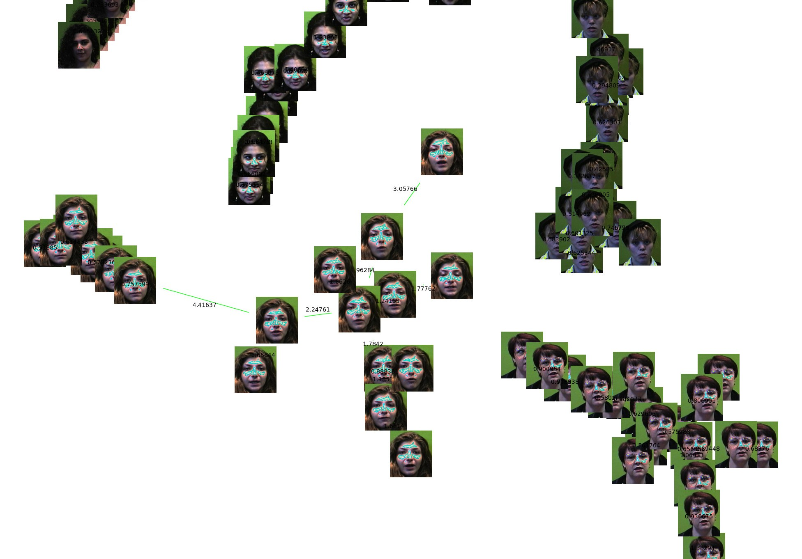

This paper is about the number 3. The number 4 is left for future work.



[Download paper here]()

Recommended citation:

```bibtex
@ARTICLE{JCC2012,
	Title	= { Agrupamiento por Similitud de Imágenes mediante árbol de Expansión Mínima y Soft Heap },
	Author	= { {Lopez del Alamo}, C.~J. and {Fuentes Perez}, L.~J. and {Romero Calla}, L.~A. },
	Journal	= { XXIV Encuentro Chileno de Computación },
	Year	= { 2012 },
	Month	= { November },
	Note	= { Jornadas Chilenas de Computación, Valparaíso, Chile }
}
```
