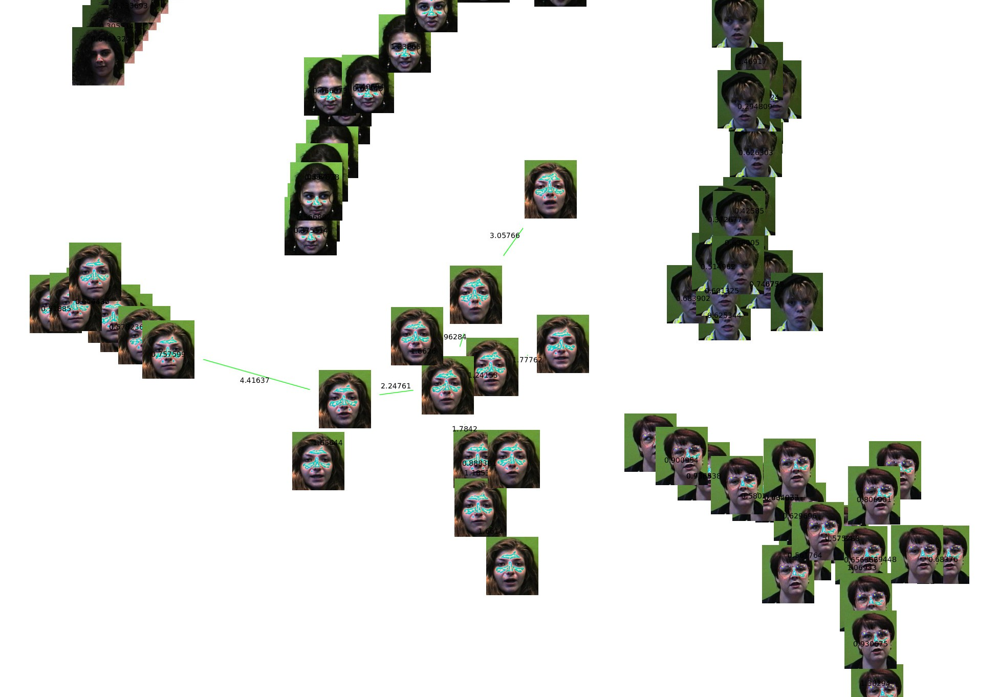

### Abstract

This research proposes a grouping of faces
using a minimum spanning tree. The Prim’s algorithm is
optimized using the structure Soft Heap as priority queue,
and tests are done to check its efficiency compared to
Prim’s algorithm with a Fibonacci Heap as queue priority.
The characteristic vector is obtained by the Haar wavelet,
and for the distances between images are used Euclidean
distance between their feature vectors.

[Download paper here](https://goo.gl/AUn6E4)

Recommended citation:

```
@ARTICLE{JCC2012,
	Title	= { Agrupamiento por Similitud de Imágenes mediante árbol de Expansión Mínima y Soft Heap },
	Author	= { {Lopez del Alamo}, C.~J. and {Fuentes Perez}, L.~J. and {Romero Calla}, L.~A. },
	Journal	= { XXIV Encuentro Chileno de Computación },
	Year	= { 2012 },
	Month	= { November },
	Note	= { Jornadas Chilenas de Computación, Valparaíso, Chile }
}
```
