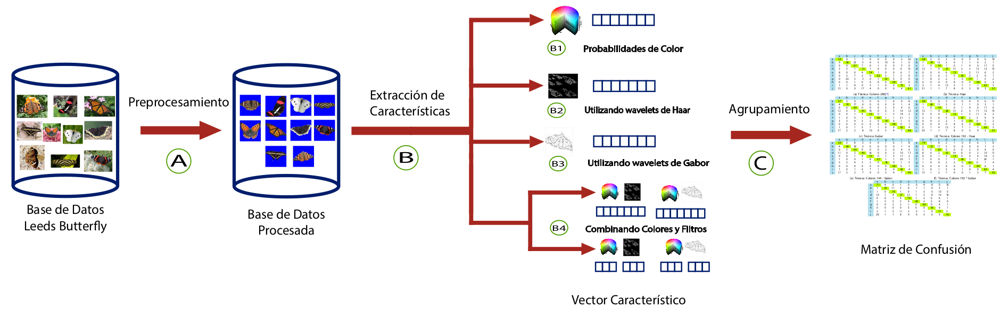

This paper is about ...

[Download paper here]()

Recommended citation:

```
@InProceedings{CLEI2013,
	Title	= { A novel approach for image feature extraction using HSV model color and filters wavelets },
	Author	= { {Lopez del Alamo}, C.~J. and {Fuentes Perez}, L.~J. and {Romero Calla}, L.~A. and {Ramos Lovon}, W.~R.},
	Booktitle	= { Computing Conference (CLEI), 2013 XXXIX Latin American },
	Year	= { 2013 },
	Month	= { Oct },
	Pages	= { 1-7 },
	Doi	= { 10.1109/CLEI.2013.6670598 }
}
```
