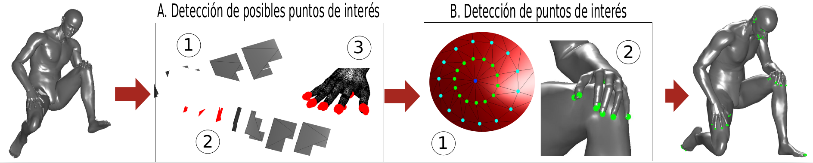

### Abstract


Due to the increasing amount of data and the reduction of costs in 3D data acquisition devices, there has been a growing interest, in developing efficient and robust feature extraction algorithms for 3D shapes, invariants to isometric, topological and noise changes, among others. One of the key tasks for feature extraction in 3D shapes is the interest points detection; where interest points are salient structures, which can be used, instead of the whole object. In this research, we present a new approach to detect interest points in 3D shapes by analyzing the triangles that compose the mesh which represent the shape, in different way to other algorithms more complex such as Harris 3D or HKS. Our results and experiments of repeatability, confirm that our algorithm is stable and robust, in addition, the computational complexity is O(n log n), where n represents the number of faces of the mesh.

[Download paper here](https://ieeexplore.ieee.org/document/7359459)
Recommended citation:

```
@INPROCEEDINGS{CLEI2015,
	Title	= { Efficient approach for interest points detection in non-rigid shapes },
	Author	= { {Lopez Del Alamo}, Cristian Jose and {Romero Calla}, Luciano Arnaldo and {Fuentes Perez}, Lizeth Joseline },
	Booktitle	= { Computing Conference (CLEI), 2015 Latin American },
	Year	= { 2015 },
	Month	= { Oct },
	Pages	= { 1-8 },
	Doi	= { 10.1109/CLEI.2015.7359459 },
}
```
