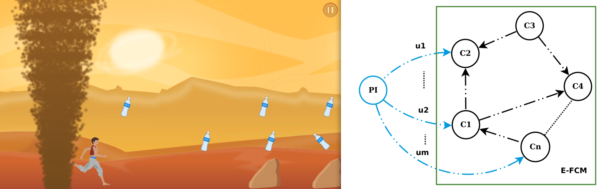

This paper is about ...

[Download paper here]()

Recommended citation:

```
@INPROCEEDINGS{SBGAMES2015,
	Title	= { Dynamic Game Difficulty Balancing in Real Time Using Evolutionary Fuzzy Cognitive Maps },
	Author	= { {Fuentes Perez}, Lizeth Joseline and {Romero Calla}, Luciano Romero and Valente, Luis and Montenegro, Anselmo Antunes and {Gonzalez Clua}, Esteban Walter},
	Booktitle	= { 2015 14th Brazilian Symposium on Computer Games and Digital Entertainment (SBGames) },
	Year	= { 2015 },
	Month	= { Nov },
	Pages	= { 24-32 },
	Doi	= { 10.1109/SBGames.2015.17 }
}
```
