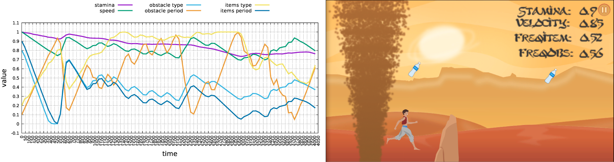

This paper is about ...

[Download paper here]()

Recommended citation:

```
@Article{FuentesPerez2016a,
	Title	= { Dynamic game difficulty balancing in real time using Evolutionary Fuzzy Cognitive Maps with automatic calibration },
	Author	= { {Fuentes Perez}, Lizeth Joseline and {Romero Calla}, Luciano Romero and Montenegro, Anselmo Antunes and Valente, Luis and {Gonzalez Clua}, Esteban Walter },
	Journal	= { SBC Journal on Interactive Systems },
	Year	= { 2016 },
	Note	= { ISSN: 2236-3297 },
	Number	= { 1 },
	Pages	= { 38-50 },
	Volume	= { 7 },
	Url	= { http://seer.ufrgs.br/index.php/jis/article/view/63683 }
}
```
