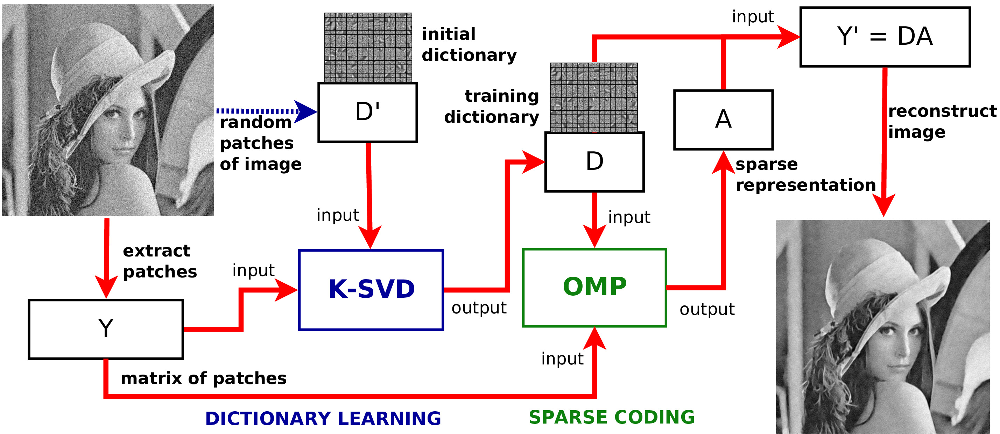

[Download poster here](http://on-demand.gputechconf.com/gtc/2016/posters/GTC_2016_Performance_Optimization_PO_01_P6294_WEB.pdf)

Recommended citation:

```
@MISC{FuentesPerez2016,
	Title	= { A Dictionary Learning approach in GPU for Image Denoising },
	Author	= { {Fuentes Perez}, Lizeth Joseline and {Romero Calla}, Luciano Arnaldo and Montenegro, Anselmo Antunes },
	HowPublished	= { Poster presented at NVIDIA GPU Technology Conference 2016 },
	Month 	= { April},
	Year	= { 2016 },
	Url	= { http://on-demand.gputechconf.com/gtc/2016/posters/GTC_2016_Performance_Optimization_PO_01_P6294_WEB.pdf }
}
```
