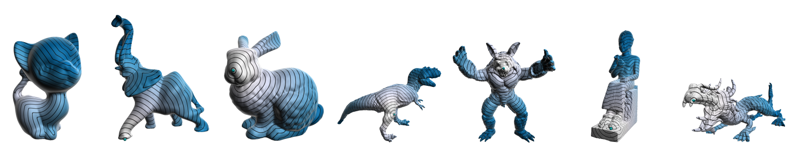

### Abstract


The computation of geodesic distances is an important research topic in Geometry Processing and 3D Shape Analysis as it is a basic component of many methods used in these areas. For this reason, different approaches have been proposed to compute geodesic distances including exact and approximate methods. Approximate methods are usually used when efficiency is mandatory and particularly when dealing with large meshes. One of the most well-known methods used for computing approximate geodesic distances is the Fast Marching algorithm. Recently, new methods have been proposed: the spectral and diffusion flow-based methods. These approaches are very efficient for distance query but usually depend on computationally intensive preprocessing steps. In this work, we present an iterative parallel algorithm based on front propagation to compute approximate geodesic distances on meshes that is practical and simple to implement. The convergence of our iterative algorithm depends on the number of discrete level sets around the source points from which distance information propagates. To appropriately implement our method in GPUs taking into account memory coalescence problems, we devised a new graph representation based on a breadth-first search traversal that works harmoniously with our parallel front propagation approach. In the experiments, we show how our method scales with the size of the problem by using the proposed graph representation. We compare its mean error and processing times with such measures computed using other methods. We also demonstrate its use for solving two classical geometry processing problems: the regular sampling problem and the Voronoi tessellation on meshes.

[Download paper here](https://arxiv.org/abs/1810.08218)

Recommended citation:

```
@ARTICLE{2018arXiv181008218R,
	author	= { {Romero Calla}, L.~A. and {Fuentes Perez}, L.~J. and {Montenegro}, A.~A. and {Lage}, M. },
	title	= { An Iterative Parallel Algorithm for Computing Geodesic Distances on Triangular Meshes },
	journal	= { ArXiv e-prints },
	eprint	= { 1810.08218 },
	year	= 2018,
	month	= oct,
	url	= { https://arxiv.org/abs/1810.08218 }
}
```
