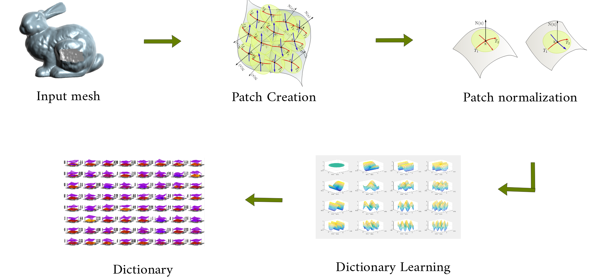

This paper is about ...

[Download paper here]()

Recommended citation:

```
@ARTICLE{2018arXiv181008266F,
	author	= { {Fuentes Perez}, L.~J. and {Romero Calla}, L.~A. and {Montenegro}, A.~A. },
	title	= { Dictionary Learning-based Inpainting on Triangular Meshes },
	journal	= { ArXiv e-prints },
	eprint	= { 1810.08266 },
	year	= 2018,
	month	= oct,
	url	= { https://arxiv.org/abs/1810.08266 }
}
```
