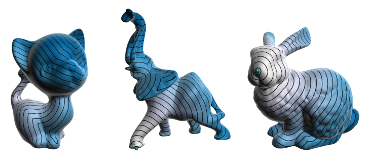

### Abstract

The computation of geodesic distances is an important research topic in Geometry Processing and 3D Shape Analysis as it is a basic component of many methods used in these areas. In this work, we present a minimalistic parallel algorithm based on front propagation to compute approximate geodesic distances on meshes. Our method is practical and simple to implement, and does not require any heavy pre-processing. The convergence of our algorithm depends on the number of discrete level sets around the source points from which distance information propagates. To appropriately implement our method on GPUs taking into account memory coalescence problems, we take advantage of a graph representation based on a breadth-first search traversal that works harmoniously with our parallel front propagation approach. We report experiments that show how our method scales with the size of the problem. We compare the mean error and processing time obtained by our method with such measures computed using other methods. Our method produces results in competitive times with almost the same accuracy, especially for large meshes. We also demonstrate its use for solving two classical geometry processing problems: the regular sampling problem and the Voronoi tessellation on meshes.


**DOI:** [10.1016/j.cag.2019.08.014](https://doi.org/10.1016/j.cag.2019.08.014)<br/>
**arXiv:** [https://arxiv.org/abs/1810.08218](https://arxiv.org/abs/1810.08218)


BibTeX:

```
@Article{RFM19,
    author       = { {Romero Calla}, Luciano A. and {Fuentes Perez}, Lizeth J. and Montenegro, Anselmo A. },
    title        = { A minimalistic approach for fast computation of geodesic distances on triangular meshes },
    issn         = { 0097-8493 },
    year         = { 2019 },
    doi          = { 10.1016/j.cag.2019.08.014 },
    journaltitle = { Computers \& Graphics }
}
```
