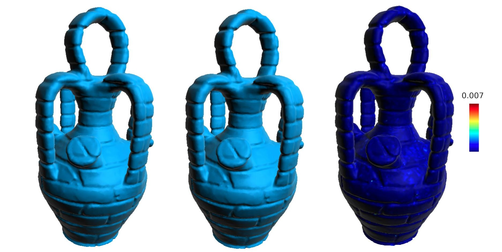

### Abstract

The sparse representation of signals defined on Euclidean domains has been successfully applied in signal processing. Bringing the power of sparse representations to non-regular domains is still a challenge, but promising approaches have started emerging recently. In this paper, we investigate the problem of sparsely representing discrete surfaces and propose a new representation that is capable of providing tools for solving different geometry processing problems. The sparse discrete surface representation is obtained by combining innovative approaches into an integrated method. First, to deal with irregular mesh domains, we devised a new way to subdivide discrete meshes into a set of patches using a feature-aware seed sampling. Second, we achieve good surface approximation with over-fitting control by combining the power of a continuous global dictionary representation with a modified Orthogonal Marching Pursuit. The discrete surface approximation results produced were able to preserve the shape features while being robust to over-fitting. Our results show that the method is quite promising for applications like surface re-sampling and mesh compression.


**DOI:** [10.2312/pg.20201226](https://doi.org/10.2312/pg.20201226)<br/>
**arXiv:** [https://arxiv.org/abs/1810.08266](https://arxiv.org/abs/1810.08266)


BibTeX:

```
@InProceedings{FRMMP20,
    booktitle    = { Pacific Graphics Short Papers, Posters, and Work-in-Progress Papers},
    title        = { {A Robust Feature-aware Sparse Mesh Representation} },
    author       = { {Fuentes Perez}, Lizeth J.  and {Romero Calla}, Luciano A. and Montenegro, Anselmo A. and Mura, Claudio and Pajarola, Renato },
    year         = { 2020 },
    publisher    = { The Eurographics Association },
    ISBN         = { 978-3-03868-120-5 },
    DOI          = { 10.2312/pg.20201226 }
}
```
