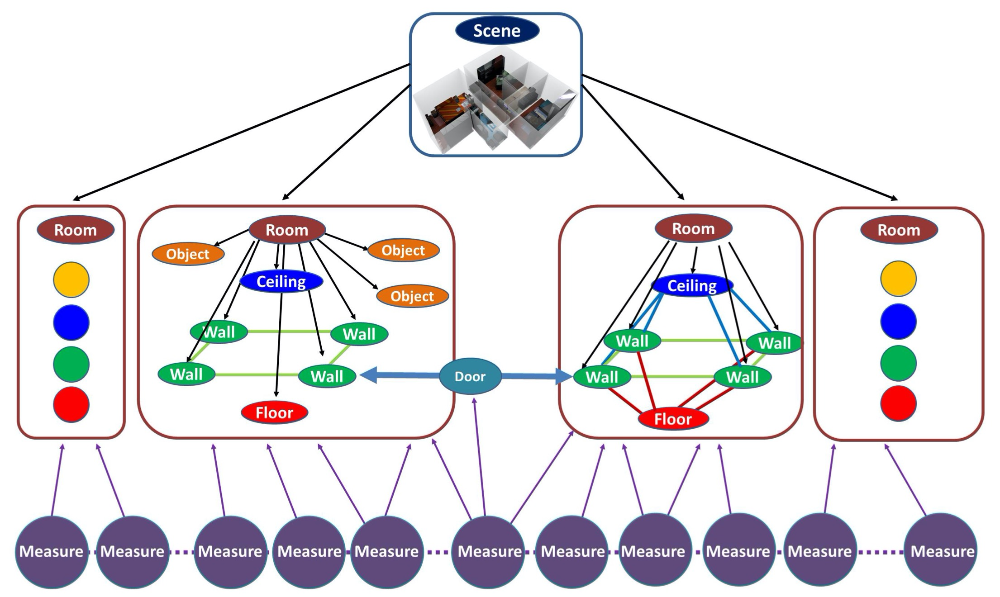

### Abstract

Creating high-level structured 3D models of real-world indoor scenes from captured data is a fundamental task which has important applications in many fields. Given the complexity and variability of interior environments and the need to cope with noisy and partial captured data, many open research problems remain, despite the substantial progress made in the past decade. In this survey, we provide an up-to-date integrative view of the field, bridging complementary views coming from computer graphics and computer vision. After providing a characterization of input sources, we define the structure of output models and the priors exploited to bridge the gap between imperfect sources and desired output. We then identify and discuss the main components of a structured reconstruction pipeline, and review how they are combined in scalable solutions working at the building level. We finally point out relevant research issues and analyze research trends.v

**DOI:** [10.1111/cgf.14021](https://doi.org/10.1111/cgf.14021)<br/>


BibTeX:

```
@article{PMGFPG:20,
author    = {Pintore, Giovanni and Mura, Claudio and Ganovelli, Fabio and {Fuentes Perez}, Lizeth and Pajarola, Renato and Gobbetti, Enrico},
title     = {State-of-the-art in Automatic 3D Reconstruction of Structured Indoor Environments},
journal   = {Computer Graphics Forum},
volume    = {39},
number    = {2},
pages     = {667-699},
keywords  = {CCS Concepts, • Computing methodologies → Computer graphics, Shape modeling, Computer vision, Computer vision problems, Shape inference, Reconstruction, • Applied computing → Computer-aided design},
doi       = {https://doi.org/10.1111/cgf.14021},
year      = {2020}
}

```
